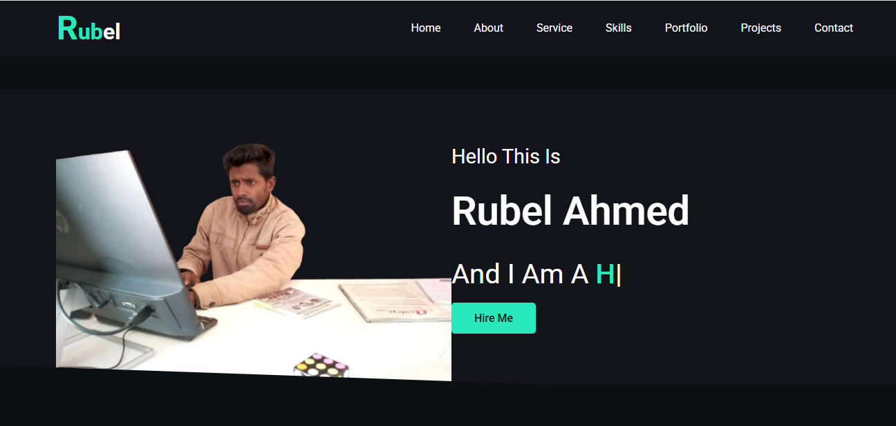
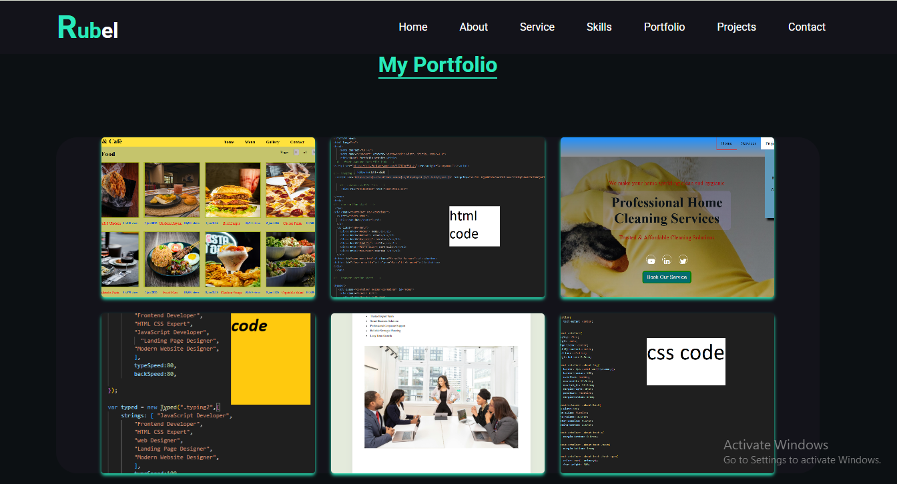
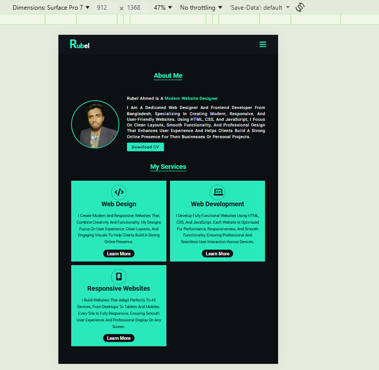

# 🌐 My Portfolio Website

Welcome to my personal portfolio website repository.

This project represents my skills, projects, and professional background as a Web Designer & Frontend Developer.

## 🚀 Live Preview
( live website link here )https://md-rubel-portfolio.netlify.app/

## 🛠️ Built With

- HTML5
- CSS3
- JavaScript
- Responsive Design
- Font Awesome

## 📂 Project Structure

my-portfolio/
│
├── index.html
├── cookie.html
├── terms.html
├── privency.html
│
├── css/
│ └── style.css
│
├── js/
│ └── script.js
│
└── img/
└── (images & screenshots)

## ✨ Features

- Fully Responsive Design
- Modern UI Layout
- Smooth Navigation
- Clean Code Structure
- Cross-browser Compatible

## 📸 Screenshots

### 🏠 Homepage

### 📱 Responsive View

## 👨‍💻 Author

**Md Rubel Ahmed**  
Web Designer & Frontend Developer  

📧 Contact:( mdrubelahmed3965@gmail.com )  
🌍 Location: Bangladesh  

## 📄 License

This project is open-source and free to use for learning purposes.
